<!-- [TOC] -->

# 引言

## 目的

本文档编写的目的是为了规范软件代码的结构等方面，防止在之后的开发中出现软件结构混乱、命名冲突等问题。

## 命名规范

代码的命名和编写规范见 [这篇关于命名规范的文档][cs_coding_standards]

[cs_coding_standards]: http://github.com/ktaranov/naming-convention/blob/master/C%23%20Coding%20Standards%20and%20Naming%20Convensions

## 定义

- N/A: Not Applicable，无、不适用
- 玩家: 指游玩此游戏的人
- 系统/程序: 指游戏本身
- Unity: [Unity3D][unity] 游戏引擎
- mod、模组: 玩家为了改善/改变游戏体验自行向游戏添加的插件、资源等

[unity]: https://unity.com

## 参考资料

1. Unity Scripting Reference (<https://docs.unity3d.com/ScriptReference>)
2. Unity Manual (<https://docs.unity3d.com/Manual>)
3. Microsoft Docs (<https://docs.microsoft.com/zh-cn/>)

## 相关文档

1. 开发需求说明书 (<https://github.com/01010101lzy/software-engineering-simulator/blob/master/docs/homework/spec.md>)
2. 软件开发计划书 (<https://github.com/01010101lzy/software-engineering-simulator/blob/master/docs/homework/dev_plan.md>)

## 版本历史

见本文件在 GitHub 的[版本历史][git_history]。

[git_history]: https://github.com/01010101lzy/software-engineering-simulator/commits/master/docs/homework/design_manual.md

# 总体结构设计

: 游戏界面的结构与依赖关系。图中的箭头表示依赖于被指向模块或类的方法和/或数据

待补充。

# 场景和控制器设计

## 场景设计

场景（Scene）是 Unity 中对于游戏中不同场景的抽象。

: 场景一览表（部分未实现）

| 场景                | 用途             |
|---------------------|------------------|
| `MainGameplayScene` | 游戏主界面       |
| `MainMenuScene`     | 游戏主菜单       |
| `SplashScreenScene` | 加载界面         |
| `SettingsScene`     | 设置界面         |
| `CreditsScene`      | 工作人员列表界面 |

### `MainGameplayScene`

`MainGameplayScene` 是游戏的主界面，主要包含以下部分：

- 最左侧的面板切换菜单，用于切换信息面板所显示的内容，以及暂停游戏；
- 左侧的信息面板，用于显示人员、任务、资金、统计等方面的详细信息；
- 右侧的概览面板，用于显示玩家控制的公司的概况（如资金、声望等），以及游戏内的通知；
- 中间的公司视图，以可视化的方式展示公司内当前的状态（如员工是否工作），并允许玩家与公司内的元素互动。

: 游戏主界面（设计稿，暂定）

### `MainMenuScene`

`MainMenuScene` 是游戏的主菜单。用户可以在此执行以下操作：

- 新建游戏存档
- 加载已有的存档
- 修改游戏设置
- 查看制作人员名单
- 退出游戏

: 游戏主菜单（设计稿，暂定）

### `SplashScreenScene`

`SplashScreenScene` 是游戏的加载界面。在显示加载界面时游戏在后台加载游戏的资源和/或存档文件。加载界面使用一个类似命令行的界面显示加载进度条和正在加载的内容。

### `SettingsScene`

`SettingsScene` 是游戏的设置界面。由于截至本文档的最近一次更新时，游戏的设置项内容还未确定下来，所以本场景的设计还未确定。

### `CreditsScene`

`CreditsScene` 在游戏中展示制作人员信息。由于本场景的优先级很低，所以截至本文档的最后一次更新时其设计还未确定。

## 控制器设计

控制器是直接或间接控制游戏物体的对象。

: 主要控制器表（部分还未实现）

| 类名[^1]                              | 用途                               |
|---------------------------------------|------------------------------------|
| `MainGame.CompanyActionController`    | 进行游戏每帧的状态更新等工作       |
| `MainGame.*PanelController`           | 控制游戏中的面板显示数据           |
| `Persistent.PersistentUIController`   | 用于控制在场景切换时不被销毁的对象 |
| `Persistent.SaveController`           | 用于管理存档文件                   |
| `Splashscreen.MainMenuController`     | 用于管理主菜单                     |
| `Splashscreen.SplashScreenController` | 用于控制加载界面                   |

[^1]: 所有控制器都在 `Sesim.Controllers` 命名空间下。

# 存档结构设计

SESim 的存档使用 Ceras 序列化器序列化为二进制存储。存档使用的序列化/反序列化器支持在以后的更新中添加或删除键值，所以此表的内容在开发过程中还有可能继续修改。每一个存档被存储为两个部分：元数据 `SaveMetadata` 和存档本身 `SaveFile`。存档各部分结构如下：

: 存档元数据 `SaveMetadata` 结构

| 变量            | 类型    | 说明         |
|-----------------|---------|--------------|
| `version`       | long    | 游戏版本     |
| `id`            | Ulid    | 的唯一标识符 |
| `name`          | string  | 标题         |
| `ut`            | int     | 游戏内时间   |
| `fund`          | decimal | 资金         |
| `reputation`    | float   | 声望         |
| `employeeCount` | int     | 员工数       |
| `contractCount` | int     | 任务数       |

: 存档数据 `SaveFile` 结构

| 变量       | 类型               | 说明                 |
|------------|--------------------|----------------------|
| `version`  | long               | 游戏版本             |
| `id`       | Ulid               | 唯一标识符           |
| `name`     | string             | 标题                 |
| `company`  | Company            | 模拟公司信息         |
| `settings` | DifficultySettings | 难度设定（尚未确定） |

: 公司信息 `Company` 结构

| 变量                 | 类型                         | 说明                          |
|----------------------|------------------------------|-------------------------------|
| `name`               | string                       | 公司名                        |
| `ut`                 | int                          | 游戏时间（一小时为 300 tick） |
| `fund`               | decimal                      | 资金                          |
| `reputation`         | float                        | 声望                          |
| `avaliableContracts` | List\<Contract>              | 可接任务列表                  |
| `contracts`          | List\<Contract>              | 任务列表                      |
| `avaliableEmployees` | List\<Employee>              | 可招聘员工列表                |
| `employees`          | List\<Employee>              | 员工列表                      |
| `workTimes`          | List\<WorkPeriod>            | 公司作息                      |
| `extraData`          | Dictionary\<String, dynamic> | 为模组预留的数据存储          |

: 任务信息 `Contract` 结构

| 变量                           | 类型                         | 说明                 |
|--------------------------------|------------------------------|----------------------|
| `id`                           | Ulid                         | 唯一标识符           |
| `name`                         | string                       | 名称                 |
| `status`                       | ContractStatus               | 状态                 |
| `description`                  | string                       | 描述                 |
| `contractor`                   | string                       | 甲方名称             |
| `difficulty`                   | float                        | 难度                 |
| `hasExtendedMaintenancePeriod` | bool                         | 是否有维护期         |
| `startTime`                    | int                          | 开始时间             |
| `liveTime`                     | int                          | 在任务表中存活时间   |
| `timeLimit`                    | int                          | 结束时间             |
| `extendedTimeLimit`            | int                          | 维护期结束时间       |
| `members`                      | List\<Employee>              | 负责任务的员工       |
| `techStackPreference`          | Dictionary\<string, float>   | 偏好的技术栈         |
| `techStack`                    | string                       | 玩家选择的技术栈     |
| `totalWorkload`                | double                       | 总工作量             |
| `completedWork`                | double                       | 已完成工作量         |
| `depositReward`                | ContractReward               | 接单奖励             |
| `completeReward`               | ContractReward               | 完成奖励             |
| `maintenanceMonthlyReward`     | ContractReward               | 维护期每月奖励       |
| `breakContractPunishment`      | ContractReward               | 违约惩罚             |
| `completeCondition`            | ICompleteCondition           | 完成条件             |
| `extraData`                    | Dictionary\<String, dynamic> | 为模组预留的数据存储 |

: 员工信息 `Employee` 结构

| 变量                      | 类型                         | 说明                  |
|---------------------------|------------------------------|-----------------------|
| `id`                      | Ulid                         | 唯一标识符            |
| `name`                    | string                       | 姓名                  |
| `experience`              | float                        | 经验                  |
| `baseEfficiency`          | float                        | 基础效率              |
| `abilities`               | Dictionary\<string, float>   | 不同技术栈的技能      |
| `salary`                  | decimal                      | 工资                  |
| `health`                  | float                        | 健康度                |
| `pressure`                | float                        | 压力大小              |
| `lastWorkTime`            | int                          | 上次工作开始时间      |
| `isWorking`               | bool                         | 是否在工作            |
| `position`                | Vector3                      | 在公司视图中的位置    |
| `rotation`                | Quaternion                   | 在公司视图中的旋转    |
| `efficiencyTimeCurve`     | AnimationCurve               | 效率-工作时间关系曲线 |
| `efficiencyHealthCurve`   | AnimationCurve               | 效率-健康度关系曲线   |
| `efficiencyPressureCurve` | AnimationCurve               | 效率-压力大小关系曲线 |
| `extraData`               | Dictionary\<string, dynamic> | 为模组预留的数据存储  |

: 公司作息时间 `WorkPeriod` 结构

| 变量    | 类型 | 说明         |
|---------|------|--------------|
| `start` | int  | 工作开始时间 |
| `end`   | int  | 工作结束时间 |

: 任务奖励 `ContractReward` 结构

| 变量         | 类型    | 说明       |
|--------------|---------|------------|
| `fund`       | decimal | 资金增加量 |
| `reputation` | float   | 声望增加量 |

# 配置文件结构设计

待补充

# 其他设计

待补充。

# 错误处理机制

待补充。

# 测试计划

截至本次文档更新时，开发组已在 Travis CI 上设置了测试流水线。流水线在每一次代码提交之后都会对当前提交的版本进行单元测试和集成测试，并将测试结果发回代码所有者和组长的邮箱中。

[travis_repo]: https://travis-ci.com/01010101lzy/software-engineering-simulator/
